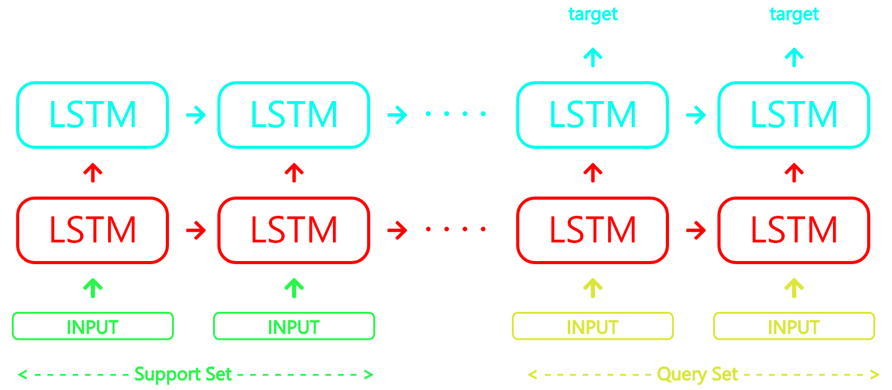

# Black-Box-Meta-Learning

This repo implements and trains a memory augmented neural networks, a black-box meta-learner that uses a recurrent neural network for few shot classification

This repository contains:

1. The [python code](BlackBox.py)
2. The [config file](config.json)
3. [CS330 HW1 file](CS330_HW1.pdf)
4. And the [ReadMe file](README.md) itself

## Table of Contents

- [About](#about)
- [To Run](#to-run)
- [References](#references)


## About

### Dataset
The [Omniglot data](https://github.com/brendenlake/omniglot) set is designed for developing more human-like learning algorithms. It contains 1623 different handwritten characters from 50 different alphabets. Each of the 1623 characters was drawn online via Amazon's Mechanical Turk by 20 different people. The Omniglot data set contains 50 alphabets. It is split into a background set of 30 alphabets and an evaluation set of 20 alphabets.

### Model
A stacked 2 layered-LSTM model is employed. The model takes in the flattened train image and their corresponding target labels as the input to predict the labels of the test images. More information on the training procedure could be found in [HW1 of CS330](https://github.com/siddarth-c/Black-Box-Meta-Learning/blob/main/CS330_HW1.pdf). The hyper-parameters can be changed in the [config file](config.json). <br>


## To Run

Download the omniglot data [here](https://www.kaggle.com/watesoyan/omniglot/download) and save the downloaded folders in a folder titled 'omniglot'. Save the [python code](BlackBox.py) and [config file](config.json) in the same directory of 'omniglot'.

```

BlackBox.py
config.json
omniglot
│___  images_background
│___  images_evaluation    

```
Run BlackBox.py 
```
python3 BlackBox.py
```

## References
1. This work is inspired by Stanford's [CS 330: Deep Multi-Task and Meta Learning](http://cs330.stanford.edu/)
2. A similar implementation could be found [here](https://github.com/Luvata/CS330-Stanford-Deep-Multi-Task-and-Meta-Learning/tree/master/HW1)
3. A [blog](https://research.aimultiple.com/few-shot-learning/) on Few shot learning
4. Stanford's lecture series on CS 330: Deep Multi-Task and Meta Learning in [YouTube](https://www.youtube.com/playlist?list=PLoROMvodv4rMC6zfYmnD7UG3LVvwaITY5)
